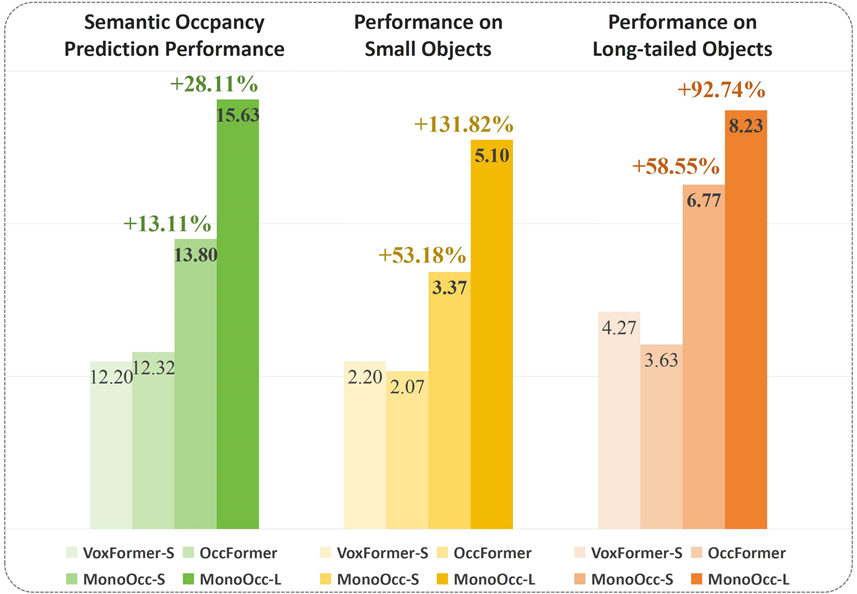
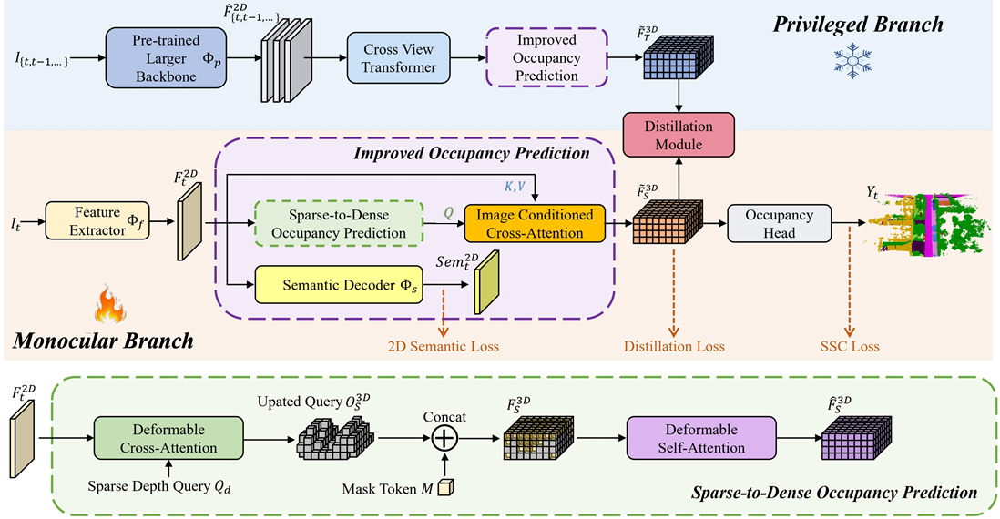

   
  
# MonoOcc: Digging into Monocular Semantic Occupancy Prediction

Our method outperforms the 
state-of-the-art
MonoOcc and OccFormer
in the SSC mIoU, 
while also achieving a significant boost
on both small objects (bicycle, motorcycle, traffic-sign)
and long-tailed objects (truck, other-vehicle, other-ground).

## Abstract
Monocular Semantic Occupancy Prediction aims to infer the complete 3D geometry and semantic information of scenes from only 2D images. It has garnered significant attention, particularly due to its potential to enhance the 3D perception of autonomous vehicles. However, existing methods rely on a complex cascaded framework with relatively limited information to restore 3D scenes, including a dependency on supervision solely on the whole network's output, single-frame input, and the utilization of a small backbone. These challenges, in turn, hinder the optimization of the framework and yield inferior prediction results, particularly concerning smaller and long-tailed objects.
To address these issues, we propose MonoOcc. In particular, we (i) improve the monocular occupancy prediction framework by proposing an auxiliary semantic loss as supervision to the shallow layers of the framework and an image-conditioned cross-attention module to refine voxel features with visual clues, and (ii) employ a distillation module that transfers temporal information and richer knowledge from a larger image backbone to the monocular semantic occupancy prediction framework with low cost of hardware. With these advantages, our method yields state-of-the-art performance on the camera-based SemanticKITTI Scene Completion benchmark. Codes and models can be accessed at https://github.com/ucaszyp/MonoOcc.

## Method

 

## Getting Started
- [Installation](docs/install.md) 
- [Prepare Dataset](docs/prepare_dataset.md)
- [Run and Eval](docs/getting_started.md)

## Model Zoo

| Backbone  | Dataset | mIoU(Val) | mIoU(Test) | Download |
| :---: | :---: | :---: | :---: | :---: |
| R50  | SemanticKITTI | 14.01 | 13.80 | [model](https://drive.google.com/file/d/1dnRcpQC_TOCL4IsGgG1TUfiAkqGQI4cc/view?usp=sharing) |
| InternImage-XL | SemanticKITTI | 15.53 | 15.63 | [model](https://drive.google.com/file/d/1dIrYwTI-2YXi8yfRgkZh4fJc-3vu-lA2/view?usp=sharing) |

 

## Acknowledgement

Many thanks to these excellent open source projects:
- [MonoOcc](https://github.com/NVlabs/MonoOcc)
- [InternImage](https://github.com/OpenGVLab/InternImage)
- [OccFormer](https://github.com/zhangyp15/OccFormer)
- [BEVFormer](https://github.com/fundamentalvision/BEVFormer)
- [mmdet3d](https://github.com/open-mmlab/mmdetection3d)
- [MonoScene](https://github.com/astra-vision/MonoScene)
- [LMSCNet](https://github.com/astra-vision/LMSCNet)
- [semantic-kitti-api](https://github.com/PRBonn/semantic-kitti-api) 
- [MobileStereoNet](https://github.com/cogsys-tuebingen/mobilestereonet)
- [Pseudo_Lidar_V2](https://github.com/mileyan/Pseudo_Lidar_V2)

